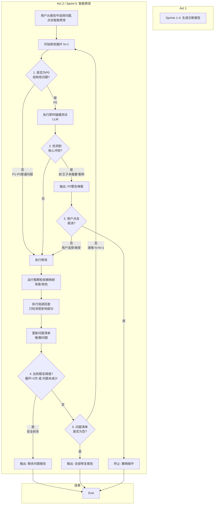

# Act1工时减少 & 无限递归问题

## 1. 关于Act1工时减少

我详细看了你排的开发计划，也结合了Beta版最核心的业务目标（Act 1）。

为了能让我们更快地验证核心逻辑，我建议我们把P2优先级的"锦上添花"功能砍掉，不影响核心价值链。

### 建议削减的任务

1. **T1.5 (文件内容去重 / 对应FR-03):** 节省 0.5 天
   - **理由：** 这是个防呆功能。Beta版我们可以先信任用户（就是我），假设不会重复上传。这个功能可以后置。

2. **T2.10 (转换进度条 / 对应FR-09):** 节省 0.5 天
   - **理由：** 这个是纯UI体验。Beta版先用一个简单的"处理中..."提示即可，不用做复杂的进度条。

3. **T3.13 (跨文件问题关联高亮 / 对应FR-10):** 节省 1 天
   - **理由：** 这也是一个高级UI功能。我们先把诊断报告（FR-07）用纯文本列表展示出来，能跑通核心逻辑就行。高亮显示可以放到下一个迭代。

### 总结

这样调整后，**总共节省2天**。

这个8天方案，完整保留了 Sprints 2 和 3 的核心——即"剧本转JSON" (FR-04) 和"AI逻辑检查与报告" (FR-05, 06, 07)，也保留了 Sprints 1 和 4 的必要地基和部署工作。

它牺牲了部分UI体验，但换来了最快的核心功能验证。我认为这对于Beta版来说是值得的，前期UI差点没关系，用户自己会适应和调整的。

你评估一下这个方案，如果技术上没问题，我们就按这个8天计划推进。

---

## 2. 修改上的无限递归问题

### 流程图（优先看）

### 流程图解读

这张图清晰地展示了我们MVP方案的**三个核心控制点**：

1. **P0冲突检测 (框 C, D, E, F)**
   - 这是"剧本医生"的核心。在**真正动手修改（H）之前**，系统必须先判断(C)这是否是一个P0级修改。
   - 如果是，就启用"即时碰撞测试"(D)来预判后果。
   - 如果检测到"结构崩溃"(E)，**系统必须停止**，并弹出(F)让用户做决策。**这是第一个"刹车"**。

2. **局部回查 (框 I, J)**
   - 这是为了防止"全局污染"。
   - 系统**不会**重新扫描整个剧本，而是根据"粗颗粒映射"(I)，只"局部回查"(J)受影响的部分。

3. **稳定阈值 (框 L)**
   - 这是为了防止"无限递归"。
   - 无论发生什么，只要循环超过3次或问题不减少(L)，系统就**强制停止**，并吐出报告(M)。**这是第二个"刹车"**。

这个流程确保了系统在V1（MVP）阶段，即使不够"智能"，也绝对**"安全"**。

---

## 3. 详细解释版

### 主题：【重要】关于"智能修改"功能（Act 2）的开发备忘录

### 3.1 核心问题与技术解决方案

**问题：** "无限递归"（越改越乱）和 "全局污染"（改A坏B）。

**原理：** 我们的解决方案，核心是从"线性、无状态的修改"转向"**有依赖、有制动的修改**"。我们不追求一步到位修好所有，而是要保证系统**"不出大乱子"**（不死循环、不毁掉其他主线）。

**技术实现（MVP三支柱）：**

1. **稳定阈值 (The "Stop Button")**
   - **解决：** 无限递归
   - **实现：** 强制停止。无论如何，修改循环一旦超过3轮（或问题无明显减少），系统就必须停止，并报告剩余问题。这是最高优先级。

2. **粗颗粒依赖映射 + 局部回查**
   - **解决：** 全局污染（改A坏B）
   - **实现：** 我们V1版不做复杂的"知识图谱"。只做"粗颗粒"映射（比如按**场景/角色**）。当系统修改了Sce. 5（含张三），它**只**回头去重新检测Sce. 5本身，以及其他所有包含张三的场景。这能防止它去污染"李四"的B线。

3. **P0冲突检测 (The "Doctor's Warning")**
   - **解决：** 主线冲突导致的结构崩溃
   - **实现：** 这是"剧本医生"MVP的核心。当系统要修改一个P0级问题（如删核心设定）时，它在后台用一个专门的LLM Prompt做一次"**即时碰撞测试**"，预判这个修改是否会炸掉其他主线的"逻辑地基"。
   - 如果会，系统**立刻停止**，并弹出一个简单的前端警告："⚠️ 警告：此修改将导致'哥哥的复仇'逻辑失效。[继续修改] [取消]"。

> **案例说明：** "王子未婚妻"问题
> 
> 比如我写王子拒绝了公主的表白，是因为前面某处写了他有一个死去的未婚妻，后来我发现我必须让他接受表白，那么就要去掉【他有一个死去未婚妻】这个设定。但是去掉这个死去未婚妻，他和前未婚妻的哥哥的仇就不成立，而她哥哥对王子的恨导致了他要向大boss出卖他……
> 
> 我的判断里，这一修改分别影响了王子的感情主线和事业主线，顺了感情线就会改错事业线，怎么办？

### 3.2 我的（编剧）角度：为什么必须这么做

从我的用户角度看，这个工具不能是一个"自作主张的实习生"，它必须是"智能副驾"。

- **我不能接受"越改越乱"：** "稳定阈值"（第1点）就是解决这个问题的。
- **我不能接受"改A坏B"：** "局部回查"（第2点）就是解决这个问题的。
- **我最不能接受"系统毁了我的核心设定"：** 我举的"王子未婚妻"的例子，如果系统为了顺A线（感情）就"自作主张"删了设定，导致B线（事业）崩溃，这个产品就是失败的。
- **"P0冲突检测"（第3点）是这个产品的灵魂。** 它必须能在"动大手术"前停下来，给我一个警告，让我这个"总编剧"来做决策。

### 3.3 新增模块与工时预估 (Act 2 / Sprint 5)

这个"智能修改"模块（Act 2）是一个全新的功能，它需要**紧跟在你当前的 Act 1 (Sprints 1-4) 完成之后**。

我们预估这第一个MVP（实现上述三支柱）需要一个**新增的 "Sprint 5"**，工时大约为 **+3天（24小时）**。

#### Sprint 5（3天）工作内容分解

**后端 (约 2 天)**
- 修改引擎Service与稳定阈值逻辑
- "粗颗粒"依赖映射（按场景/角色）与局部回查逻辑
- P0冲突的"即时碰撞测试"Prompt与后端逻辑
- 封装"执行修改"API（能返回"成功"或"冲突"）

**前端 (约 1 天)**
- 开发"P0冲突警告"的交互弹窗 [继续/取消]
- （复用Act 1的UI）

### 3.4 其他重要内容（衔接问题）

最重要的一点：**Act 2 (修改) 严重依赖 Act 1 (诊断) 的产出。**

我们现在把这个计划同步给你，主要是为了：

1. **排期：** 请你评估这额外的3天（Sprint 5）是否合理，并排入总的开发日历。

2. **架构：** 你在开发 Act 1 (特别是Sprint 3的诊断API) 时，可以提前考虑到 Act 2 会如何调用它们（比如"局部回查"时，会高频调用你的诊断API）。

请你评估一下这个"Sprint 5"的方案（+3天）是否可行，我们再碰一下细节。
