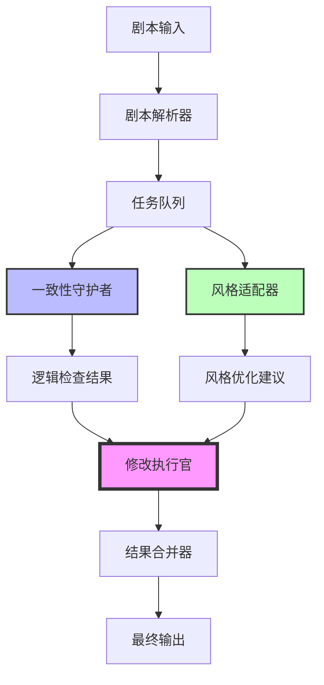

# 多Agent协作架构设计

## 🎯 架构概览

### 核心设计理念

- **并行处理**: 一致性守护者和风格适配器并行工作
- **协调决策**: 修改执行官负责最终协调
- **冲突解决**: 优先级驱动的冲突解决机制
- **性能优化**: 总响应时间控制在10秒内



---

## 📐 系统架构

### 1. 层次结构

```
┌─────────────────────────────────────────┐
│           API Gateway Layer             │
│         (REST/GraphQL接口)              │
├─────────────────────────────────────────┤
│         Agent Orchestration Layer       │
│         (Agent协调和管理)               │
├─────────────────────────────────────────┤
│           Agent Execution Layer         │
│    (3个独立Agent并行执行)              │
├─────────────────────────────────────────┤
│            LLM Provider Layer           │
│         (DeepSeek API抽象)             │
├─────────────────────────────────────────┤
│           Data Storage Layer            │
│         (PostgreSQL存储)                │
└─────────────────────────────────────────┘
```

### 2. 数据流设计

```typescript
interface ScriptAnalysisFlow {
  // 1. 输入阶段
  input: {
    scriptId: string;
    content: string;
    metadata: ScriptMetadata;
  };

  // 2. 预处理阶段
  preprocessing: {
    parsed: ParsedScript;
    segments: ScriptSegment[];
    context: AnalysisContext;
  };

  // 3. Agent处理阶段
  agentProcessing: {
    tasks: AgentTask[];
    results: AgentResult[];
    conflicts: Conflict[];
  };

  // 4. 协调阶段
  coordination: {
    resolution: ConflictResolution;
    priority: PriorityQueue;
    final: FinalDecision;
  };

  // 5. 输出阶段
  output: {
    errors: CategorizedErrors;
    suggestions: PrioritizedSuggestions;
    report: AnalysisReport;
  };
}
```

---

## 🤖 Agent详细设计

### Agent 1: 修改执行官（Modification Executive）

#### 职责定义

```yaml
name: 修改执行官
role: coordinator
priority: highest
responsibilities:
  - 接收其他Agent的分析结果
  - 检测建议间的冲突
  - 应用冲突解决策略
  - 生成最终修改方案
  - 确保修改的一致性
```

#### 冲突解决算法

```typescript
class ConflictResolver {
  private readonly priorityMatrix = {
    'logic-vs-style': 'logic', // 逻辑 > 风格
    'critical-vs-low': 'critical', // 严重 > 轻微
    'plot-vs-detail': 'plot', // 情节 > 细节
    'character-vs-scene': 'character', // 角色 > 场景
  };

  resolve(conflicts: Conflict[]): Resolution[] {
    return conflicts.map((conflict) => {
      // 1. 分类冲突类型
      const type = this.classifyConflict(conflict);

      // 2. 应用解决策略
      const strategy = this.selectStrategy(type);

      // 3. 生成解决方案
      return this.applyStrategy(strategy, conflict);
    });
  }

  private selectStrategy(type: ConflictType): Strategy {
    switch (type) {
      case 'direct':
        return new MergeStrategy();
      case 'partial':
        return new CompromiseStrategy();
      case 'exclusive':
        return new PriorityStrategy();
      default:
        return new EscalateStrategy();
    }
  }
}
```

### Agent 2: 一致性守护者（Consistency Guardian）

#### 检测能力矩阵

```typescript
interface DetectionCapabilities {
  timeline: {
    sequenceConflicts: boolean; // 时序冲突
    durationErrors: boolean; // 时长错误
    chronologyBreaks: boolean; // 时间线断裂
  };

  character: {
    personalityShifts: boolean; // 性格突变
    knowledgeInconsistency: boolean; // 知识矛盾
    relationshipErrors: boolean; // 关系错误
    motivationConflicts: boolean; // 动机冲突
  };

  continuity: {
    spatialErrors: boolean; // 空间错误
    propTracking: boolean; // 道具追踪
    environmentChanges: boolean; // 环境变化
  };

  causality: {
    causeEffectBreaks: boolean; // 因果断裂
    logicChainErrors: boolean; // 逻辑链错误
    consequenceGaps: boolean; // 结果缺失
  };

  plot: {
    unfiredChekovGuns: boolean; // 未回收伏笔
    plotHoles: boolean; // 情节漏洞
    contradictions: boolean; // 设定矛盾
  };
}
```

#### 错误权重系统

```typescript
const ERROR_WEIGHTS = {
  critical: {
    weight: 10,
    types: ['major_plot_hole', 'character_death_inconsistency', 'timeline_paradox'],
    requiresImmediate: true,
  },
  high: {
    weight: 7,
    types: ['character_knowledge_error', 'causal_break', 'scene_impossibility'],
    requiresImmediate: false,
  },
  medium: {
    weight: 4,
    types: ['minor_continuity', 'dialogue_inconsistency', 'prop_error'],
    requiresImmediate: false,
  },
  low: {
    weight: 1,
    types: ['style_inconsistency', 'minor_timing', 'description_mismatch'],
    requiresImmediate: false,
  },
};
```

### Agent 3: 风格适配器（Style Adapter）

#### 优化维度

```typescript
interface StyleDimensions {
  dialogue: {
    naturalness: number; // 自然度 0-100
    characterVoice: number; // 角色特色 0-100
    emotionalDepth: number; // 情感深度 0-100
    efficiency: number; // 简洁度 0-100
  };

  narrative: {
    pacing: number; // 节奏感 0-100
    imagery: number; // 画面感 0-100
    atmosphere: number; // 氛围营造 0-100
    readability: number; // 可读性 0-100
  };

  structure: {
    sceneTransitions: number; // 转场流畅度 0-100
    informationFlow: number; // 信息密度 0-100
    tensionCurve: number; // 张力曲线 0-100
    balance: number; // 动静平衡 0-100
  };
}
```

---

## 📊 通信协议

### 1. Agent间消息格式

```typescript
interface AgentMessage {
  header: {
    messageId: string;
    timestamp: Date;
    sender: AgentIdentifier;
    receiver: AgentIdentifier;
    priority: Priority;
    correlationId?: string;
  };

  body: {
    type: 'request' | 'response' | 'notification';
    content: {
      action: string;
      data: any;
      metadata?: any;
    };
  };

  tracking: {
    traceId: string;
    spanId: string;
    parentSpanId?: string;
  };
}
```

### 2. 协调协议

```typescript
class CoordinationProtocol {
  // 阶段1: 任务分发
  async distribute(script: ParsedScript): Promise<TaskDistribution> {
    const tasks = this.createTasks(script);

    return {
      consistency: tasks.filter((t) => t.type === 'logic'),
      style: tasks.filter((t) => t.type === 'style'),
      metadata: this.createMetadata(tasks),
    };
  }

  // 阶段2: 结果收集
  async collect(timeout: number = 8000): Promise<CollectedResults> {
    const results = await Promise.race([this.waitForAllResults(), this.timeout(timeout)]);

    return this.validateResults(results);
  }

  // 阶段3: 冲突检测
  detectConflicts(results: AgentResult[]): Conflict[] {
    const conflicts = [];

    for (let i = 0; i < results.length; i++) {
      for (let j = i + 1; j < results.length; j++) {
        const conflict = this.compareResults(results[i], results[j]);
        if (conflict) conflicts.push(conflict);
      }
    }

    return conflicts;
  }

  // 阶段4: 决策制定
  makeDecision(results: AgentResult[], conflicts: Conflict[]): FinalDecision {
    const resolved = this.resolveConflicts(conflicts);
    const merged = this.mergeResults(results, resolved);

    return {
      accepted: merged.filter((r) => r.status === 'accepted'),
      rejected: merged.filter((r) => r.status === 'rejected'),
      modified: merged.filter((r) => r.status === 'modified'),
      rationale: this.generateRationale(merged),
    };
  }
}
```

---

## ⚡ 性能优化策略

### 1. 并行处理优化

```typescript
class ParallelProcessor {
  private readonly workerPool: WorkerPool;
  private readonly cacheManager: CacheManager;

  async processInParallel(script: string): Promise<Results> {
    // 1. 分段处理长剧本
    const segments = this.segmentScript(script);

    // 2. 创建处理任务
    const tasks = segments.map((segment) => ({
      id: generateId(),
      segment,
      agents: ['consistency', 'style'],
    }));

    // 3. 并行执行
    const promises = tasks.map((task) => this.processWithCache(task));

    // 4. 等待结果
    const results = await Promise.all(promises);

    // 5. 合并结果
    return this.mergeSegmentResults(results);
  }

  private async processWithCache(task: Task): Promise<Result> {
    // 检查缓存
    const cached = await this.cacheManager.get(task.id);
    if (cached) return cached;

    // 处理任务
    const result = await this.workerPool.execute(task);

    // 存入缓存
    await this.cacheManager.set(task.id, result, 3600);

    return result;
  }
}
```

### 2. 响应时间优化

```typescript
class ResponseOptimizer {
  // 渐进式返回结果
  async *streamResults(script: string): AsyncGenerator<PartialResult> {
    // 快速返回严重错误
    yield await this.quickScan(script);

    // 返回详细分析
    yield await this.detailedAnalysis(script);

    // 返回优化建议
    yield await this.generateSuggestions(script);
  }

  // 智能超时控制
  async withSmartTimeout<T>(promise: Promise<T>, timeout: number, fallback?: T): Promise<T> {
    const timer = new Promise<T>((_, reject) =>
      setTimeout(() => reject(new Error('Timeout')), timeout),
    );

    try {
      return await Promise.race([promise, timer]);
    } catch (error) {
      if (fallback !== undefined) return fallback;
      throw error;
    }
  }
}
```

---

## 🔄 错误恢复机制

### 1. Agent失败处理

```typescript
class AgentFailureHandler {
  async handleFailure(agent: Agent, error: Error, context: Context): Promise<RecoveryAction> {
    // 1. 记录错误
    this.logger.error(`Agent ${agent.name} failed:`, error);

    // 2. 尝试恢复策略
    const strategies = [
      () => this.retry(agent, context),
      () => this.fallback(agent, context),
      () => this.degrade(agent, context),
      () => this.skip(agent, context),
    ];

    for (const strategy of strategies) {
      try {
        return await strategy();
      } catch (e) {
        continue;
      }
    }

    // 3. 最终失败处理
    return this.finalFailure(agent, error);
  }

  private async retry(agent: Agent, context: Context, maxRetries = 3) {
    for (let i = 0; i < maxRetries; i++) {
      await this.delay(Math.pow(2, i) * 1000); // 指数退避

      try {
        return await agent.process(context);
      } catch (error) {
        if (i === maxRetries - 1) throw error;
      }
    }
  }
}
```

### 2. 部分结果处理

```typescript
class PartialResultHandler {
  composePartialResults(results: PartialResult[]): FinalResult {
    // 即使某些Agent失败，也能提供有用的结果
    const successful = results.filter((r) => r.status === 'success');
    const failed = results.filter((r) => r.status === 'failed');

    return {
      complete: failed.length === 0,
      confidence: this.calculateConfidence(successful, failed),
      errors: this.extractErrors(successful),
      suggestions: this.extractSuggestions(successful),
      warnings: failed.map((f) => ({
        agent: f.agentName,
        message: `${f.agentName}分析未完成，结果可能不完整`,
      })),
    };
  }
}
```

---

## 📈 监控和指标

### 关键性能指标（KPIs）

```typescript
interface SystemMetrics {
  performance: {
    averageResponseTime: number; // 平均响应时间
    p95ResponseTime: number; // 95分位响应时间
    throughput: number; // 吞吐量（请求/秒）
    concurrentRequests: number; // 并发请求数
  };

  quality: {
    errorDetectionRate: number; // 错误检测率
    falsePositiveRate: number; // 误报率
    suggestionAcceptanceRate: number; // 建议采纳率
    userSatisfactionScore: number; // 用户满意度
  };

  reliability: {
    uptime: number; // 系统可用性
    errorRate: number; // 错误率
    agentFailureRate: number; // Agent失败率
    recoverySuccessRate: number; // 恢复成功率
  };

  cost: {
    tokensPerRequest: number; // 每请求token数
    costPerRequest: number; // 每请求成本
    dailyCost: number; // 日成本
    efficiency: number; // 成本效率
  };
}
```

### 实时监控仪表板

```typescript
class MonitoringDashboard {
  getRealtimeMetrics(): DashboardData {
    return {
      // Agent状态
      agentStatus: {
        modificationExecutive: this.checkAgentHealth('ME'),
        consistencyGuardian: this.checkAgentHealth('CG'),
        styleAdapter: this.checkAgentHealth('SA'),
      },

      // 性能指标
      performance: {
        current: this.getCurrentMetrics(),
        trend: this.getTrend('1h'),
        alerts: this.getActiveAlerts(),
      },

      // 使用统计
      usage: {
        requestsToday: this.getRequestCount('today'),
        tokensUsed: this.getTokenUsage('today'),
        costToday: this.getCost('today'),
        activeUsers: this.getActiveUsers(),
      },
    };
  }
}
```

---

## 🚀 部署架构

### 容器化部署

```yaml
# docker-compose.yml
version: '3.8'

services:
  api-gateway:
    image: screenwriter-api:latest
    ports:
      - '3000:3000'
    environment:
      - NODE_ENV=production
      - DEEPSEEK_API_KEY=${DEEPSEEK_API_KEY}
    depends_on:
      - postgres
      - redis

  agent-worker:
    image: screenwriter-agent:latest
    deploy:
      replicas: 3
    environment:
      - WORKER_TYPE=agent
      - CONCURRENT_AGENTS=2
    depends_on:
      - redis

  postgres:
    image: postgres:15
    volumes:
      - postgres_data:/var/lib/postgresql/data
    environment:
      - POSTGRES_DB=screenwriter
      - POSTGRES_PASSWORD=${DB_PASSWORD}

  redis:
    image: redis:7
    volumes:
      - redis_data:/data

volumes:
  postgres_data:
  redis_data:
```

### 扩展策略

```typescript
class ScalingStrategy {
  // 自动扩展规则
  getScalingRules(): ScalingRule[] {
    return [
      {
        metric: 'cpu',
        threshold: 70,
        action: 'scale_out',
        increment: 1,
      },
      {
        metric: 'response_time',
        threshold: 8000,
        action: 'scale_out',
        increment: 2,
      },
      {
        metric: 'queue_depth',
        threshold: 100,
        action: 'scale_out',
        increment: 1,
      },
    ];
  }

  // 负载均衡策略
  getLoadBalancingStrategy(): Strategy {
    return {
      algorithm: 'round_robin',
      healthCheck: '/health',
      stickySession: false,
      weights: {
        'agent-worker-1': 1,
        'agent-worker-2': 1,
        'agent-worker-3': 1,
      },
    };
  }
}
```

---

## 📝 最佳实践总结

### DO's ✅

1. **始终并行执行**独立的Agent任务
2. **实现渐进式结果返回**提升用户体验
3. **缓存频繁请求的结果**减少API调用
4. **设置合理的超时时间**避免长时间等待
5. **记录详细的追踪日志**便于问题排查
6. **实现优雅降级**确保部分功能可用

### DON'Ts ❌

1. **不要串行执行**可并行的任务
2. **不要忽略错误处理**和恢复机制
3. **不要硬编码**Agent优先级和规则
4. **不要忽视成本监控**避免超支
5. **不要跳过测试**特别是集成测试
6. **不要忽略用户反馈**持续优化

---

_架构版本: 1.0_
_最后更新: 2025-08-29_
_设计团队: 多Agent系统组_
