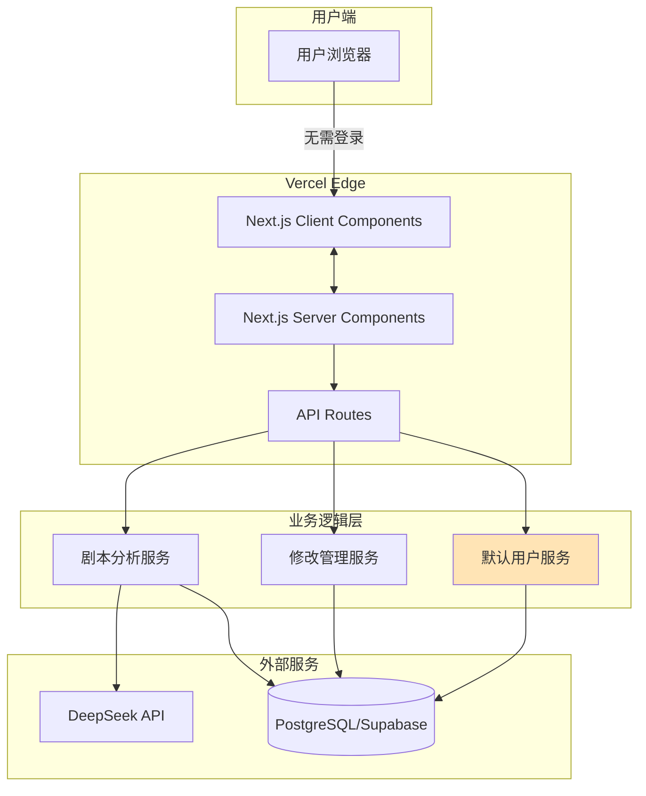

# 2. 高层架构

## 技术摘要
ScriptAI MVP采用Next.js 14单体架构部署于Vercel平台，前端使用React Server Components和Tailwind CSS构建响应式界面，后端通过API Routes处理业务逻辑并集成DeepSeek API进行AI分析。系统使用PostgreSQL存储剧本数据和分析结果，通过Prisma ORM管理数据访问，在演示模式下使用默认用户系统实现零门槛访问。整体架构优先考虑快速迭代和简单部署，通过移除认证障碍让用户能在10秒内体验核心的多Agent剧本分析功能。

## 平台与基础设施选择
**平台**: Vercel + Supabase
**核心服务**:
- Vercel: Next.js托管、Edge Functions、静态资源CDN
- Supabase: PostgreSQL数据库、存储服务
- DeepSeek API: AI Agent分析引擎

## 代码仓库结构
**结构**: 单体仓库（Monorepo）
**包组织**:
- `/app` - Next.js应用路由和页面
- `/components` - 共享UI组件
- `/lib` - 业务逻辑和工具函数
- `/prisma` - 数据库schema和迁移

## 高层架构图

