# Design Document: Story 2.3 - Collaboration Framework Development

## Executive Summary

This document outlines the design and architecture of the Collaboration Framework implemented in Story 2.3. The system enables interactive review of AI-generated script revision suggestions, allowing users to selectively accept or reject changes, preview the modified script, and export the final version in multiple formats. The framework implements a robust state management system with undo/redo capabilities and real-time UI updates.

## Architecture Overview

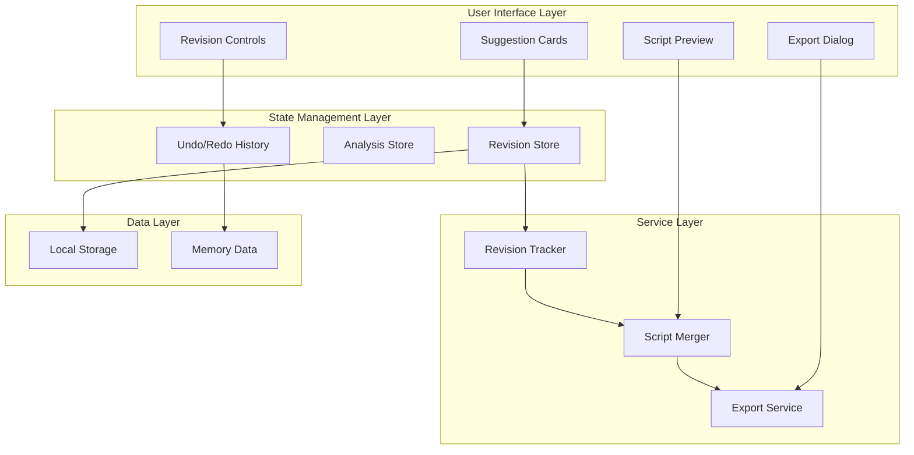

## System Components

### 1. Interactive Components Architecture

#### 1.1 Suggestion Card Component
```typescript
interface SuggestionCardProps {
  error: ExtendedError;
  onAccept: (id: string) => void;
  onReject: (id: string) => void;
  status: 'pending' | 'accepted' | 'rejected';
}
```

**Design Patterns:**
- **Presentational Component Pattern**: Pure UI component with actions passed as props
- **Compound Component Pattern**: Composed of sub-components (header, body, actions)

**Visual State Machine:**
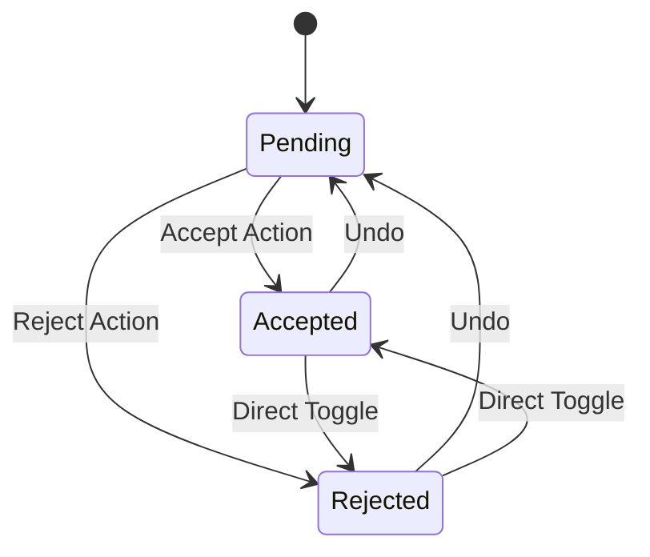

#### 1.2 Revision Controls
- **Undo/Redo Implementation**: Command Pattern with history stack
- **Keyboard Shortcuts**: Ctrl+Z (Undo), Ctrl+Y (Redo)
- **Batch Operations**: Transaction-based for multiple changes

### 2. State Management Architecture

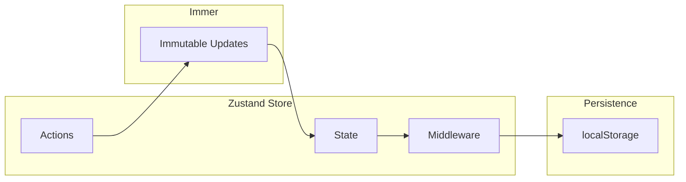

#### 2.1 Revision Store Design
```typescript
interface RevisionState {
  revisions: Map<string, RevisionStatus>;
  history: RevisionHistory[];
  currentIndex: number;
  isDirty: boolean;
}

interface RevisionActions {
  acceptSuggestion: (id: string) => void;
  rejectSuggestion: (id: string) => void;
  undo: () => void;
  redo: () => void;
  batchUpdate: (updates: RevisionUpdate[]) => void;
}
```

#### 2.2 History Management
```typescript
class HistoryManager {
  private stack: Command[];
  private pointer: number;
  
  execute(command: Command): void {
    // Remove future history
    this.stack = this.stack.slice(0, this.pointer + 1);
    // Add new command
    this.stack.push(command);
    command.execute();
    this.pointer++;
  }
  
  undo(): void {
    if (this.canUndo()) {
      this.stack[this.pointer].undo();
      this.pointer--;
    }
  }
  
  redo(): void {
    if (this.canRedo()) {
      this.pointer++;
      this.stack[this.pointer].execute();
    }
  }
}
```

### 3. Service Layer Architecture

#### 3.1 Revision Tracker Service

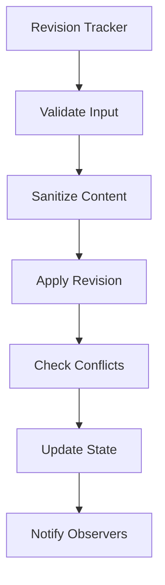

**Security Measures:**
- DOMPurify sanitization for all user inputs
- XSS prevention through content filtering
- Input validation before processing

**Conflict Resolution:**
```typescript
interface ConflictResolver {
  detectConflicts(revisions: Revision[]): Conflict[];
  resolveConflicts(conflicts: Conflict[]): Resolution[];
  mergeRevisions(revisions: Revision[]): MergedResult;
}
```

#### 3.2 Script Merger Service

**Merge Algorithm:**
```typescript
function mergeScript(original: string, revisions: Revision[]): string {
  // 1. Parse original script into segments
  const segments = parseScript(original);
  
  // 2. Sort revisions by position (reverse order)
  const sorted = revisions.sort((a, b) => b.position - a.position);
  
  // 3. Apply revisions sequentially
  for (const revision of sorted) {
    segments[revision.segmentIndex] = applyRevision(
      segments[revision.segmentIndex],
      revision
    );
  }
  
  // 4. Reconstruct script
  return segments.join('');
}
```

**Diff Visualization:**
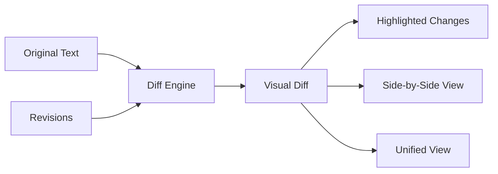

### 4. Export System Architecture

#### 4.1 Export Service Design

```typescript
interface ExportService {
  exportTxt(script: string, metadata?: ExportMetadata): Blob;
  exportDocx(script: string, options: DocxOptions): Promise<Blob>;
  exportWithChanges(script: string, changes: Change[]): Blob;
}
```

**Export Pipeline:**
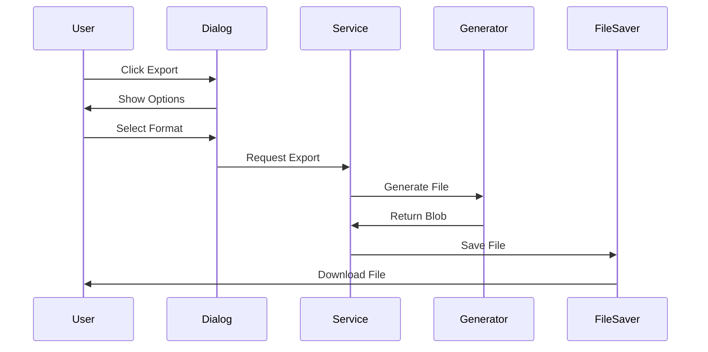

#### 4.2 Format-Specific Generators

**TXT Generator:**
- Preserves original formatting
- Applies accepted changes inline
- No additional markup or metadata

**DOCX Generator:**
- Uses docx library for generation
- Applies typography styles (headings, dialogue)
- Optional change tracking visualization
- Metadata embedding (author, date, version)

### 5. UI/UX Design Patterns

#### 5.1 Visual Feedback System

```css
/* Status-based styling */
.suggestion-card {
  &.pending { 
    background: neutral;
    border: 1px solid gray;
  }
  &.accepted { 
    background: green-50;
    border: 2px solid green;
  }
  &.rejected { 
    background: red-50;
    opacity: 0.6;
    text-decoration: line-through;
  }
}
```

#### 5.2 Interaction Patterns

**Progressive Disclosure:**
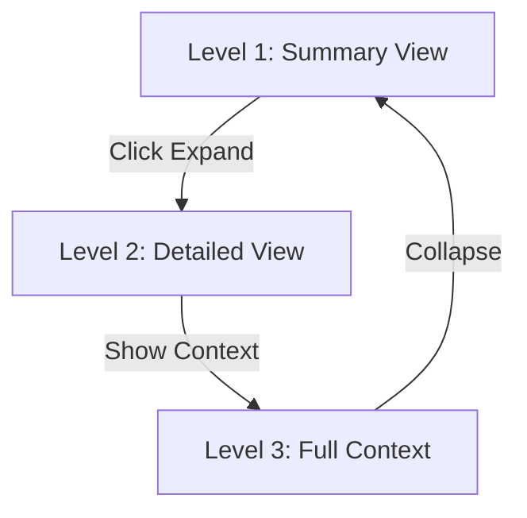

**Batch Operations Flow:**
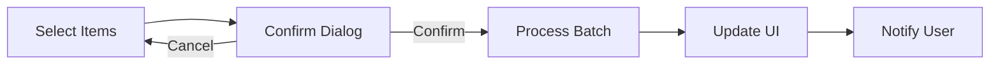

### 6. Performance Optimization Strategies

#### 6.1 Rendering Optimization

```typescript
// Memoization for expensive computations
const MemoizedDiff = React.memo(({ original, modified }) => {
  const diff = useMemo(
    () => computeDiff(original, modified),
    [original, modified]
  );
  return <DiffView diff={diff} />;
});

// Virtual scrolling for large lists
const VirtualizedErrorList = ({ errors, height }) => {
  return (
    <VirtualList
      height={height}
      itemCount={errors.length}
      itemSize={120}
      renderItem={({ index }) => (
        <SuggestionCard error={errors[index]} />
      )}
    />
  );
};
```

#### 6.2 State Update Optimization

```typescript
// Batched updates with Immer
const batchAccept = (ids: string[]) => {
  produce((draft) => {
    ids.forEach(id => {
      draft.revisions[id] = 'accepted';
    });
    draft.lastBatch = Date.now();
  });
};

// Debounced preview updates
const debouncedPreview = useMemo(
  () => debounce(updatePreview, 300),
  []
);
```

### 7. Data Flow Architecture

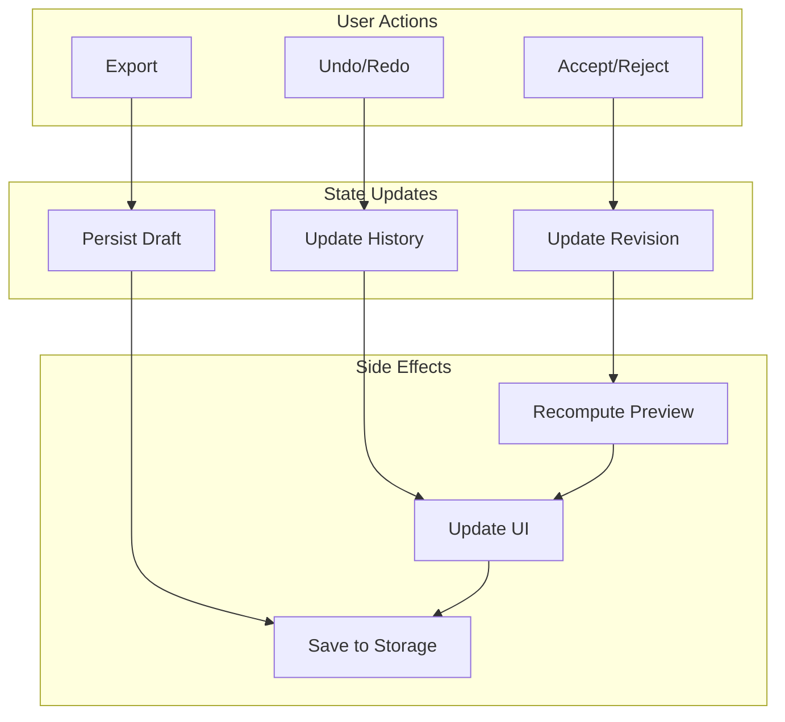

### 8. Error Handling and Recovery

#### 8.1 Error Boundary Implementation

```typescript
class RevisionErrorBoundary extends React.Component {
  componentDidCatch(error: Error, info: ErrorInfo) {
    // Log to error tracking service
    logError(error, info);
    
    // Save current state to localStorage
    saveRecoveryState(this.props.children);
    
    // Show recovery UI
    this.setState({ hasError: true });
  }
  
  recover = () => {
    const state = loadRecoveryState();
    this.props.onRecover(state);
    this.setState({ hasError: false });
  };
}
```

#### 8.2 Graceful Degradation

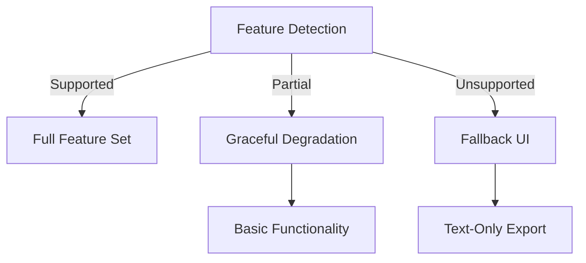

### 9. Testing Architecture

#### 9.1 Test Pyramid

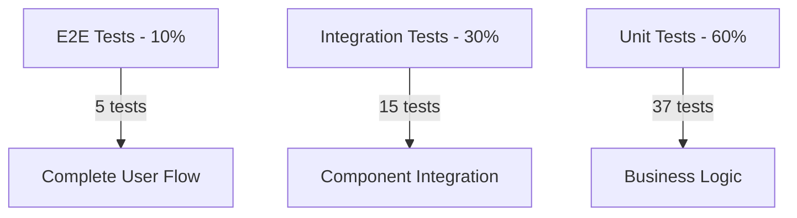

#### 9.2 Test Coverage Strategy

| Component | Coverage | Critical Paths |
|-----------|----------|----------------|
| Suggestion Card | 95% | Accept/Reject actions |
| Revision Tracker | 98% | Conflict detection |
| Export Service | 96% | Format generation |
| Script Merger | 94% | Merge algorithm |
| Revision Store | 97% | State transitions |

### 10. Security Considerations

#### 10.1 XSS Prevention

```typescript
// Input sanitization pipeline
const sanitizePipeline = (input: string): string => {
  return DOMPurify.sanitize(input, {
    ALLOWED_TAGS: [],
    ALLOWED_ATTR: [],
    KEEP_CONTENT: true
  });
};

// Safe regex execution
const safeRegexReplace = (
  text: string,
  pattern: string,
  replacement: string
): string => {
  const sanitizedPattern = sanitizePipeline(pattern);
  const sanitizedReplacement = sanitizePipeline(replacement);
  
  try {
    const regex = new RegExp(sanitizedPattern, 'g');
    return text.replace(regex, sanitizedReplacement);
  } catch (e) {
    logSecurityEvent('Invalid regex pattern', e);
    return text;
  }
};
```

#### 10.2 Content Security Policy

```typescript
// CSP headers for export downloads
const exportHeaders = {
  'Content-Security-Policy': "default-src 'none'",
  'X-Content-Type-Options': 'nosniff',
  'Content-Disposition': 'attachment'
};
```

### 11. Accessibility Design

#### 11.1 Keyboard Navigation

```typescript
const keyboardHandlers = {
  'Enter': () => toggleSelection(),
  'Space': () => toggleSelection(),
  'a': () => acceptSuggestion(),
  'r': () => rejectSuggestion(),
  'Tab': () => focusNext(),
  'Shift+Tab': () => focusPrevious(),
  'Escape': () => closeDialog()
};
```

#### 11.2 ARIA Implementation

```html
<div 
  role="article"
  aria-label="Revision suggestion"
  aria-expanded={isExpanded}
  aria-describedby={`desc-${id}`}
>
  <button
    role="button"
    aria-label="Accept suggestion"
    aria-pressed={status === 'accepted'}
  >
    Accept
  </button>
</div>
```

### 12. Scalability Considerations

#### 12.1 Large Document Handling

```typescript
// Chunked processing for large scripts
async function processLargeScript(
  script: string,
  chunkSize: number = 10000
): Promise<ProcessedScript> {
  const chunks = chunkText(script, chunkSize);
  const results = [];
  
  for (const chunk of chunks) {
    // Process in next tick to avoid blocking
    await new Promise(resolve => setTimeout(resolve, 0));
    results.push(await processChunk(chunk));
  }
  
  return mergeResults(results);
}
```

#### 12.2 Memory Management

```typescript
// Cleanup strategies
class RevisionManager {
  private cache = new WeakMap();
  
  cleanup() {
    // Clear undo history beyond threshold
    if (this.history.length > MAX_HISTORY) {
      this.history = this.history.slice(-MAX_HISTORY);
    }
    
    // Clear old drafts
    this.clearOldDrafts(DRAFT_RETENTION_DAYS);
    
    // Force garbage collection hint
    if (global.gc) global.gc();
  }
}
```

## Design Decisions

### Decision Log

| Decision | Rationale | Alternative | Trade-off |
|----------|-----------|-------------|-----------|
| Zustand for state | Lightweight, TypeScript-friendly | Redux | Less ecosystem |
| Immer for updates | Immutability with mutable API | Manual copying | Small bundle increase |
| Command Pattern for undo | Standard, extensible | Memento | More complex |
| DOMPurify for XSS | Industry standard | Manual sanitization | Dependency |
| Local Storage drafts | Persistence without backend | IndexedDB | Size limitations |

### Technology Stack Justification

- **React + Next.js**: Optimal for interactive UI with SSR capabilities
- **Zustand + Immer**: Minimal boilerplate with type safety
- **docx library**: Mature solution for Word document generation
- **DOMPurify**: Battle-tested XSS prevention

## Risk Assessment

| Risk | Probability | Impact | Mitigation |
|------|------------|--------|------------|
| Large script performance | Medium | High | Virtual scrolling, chunking |
| Browser storage limits | Low | Medium | Compression, cleanup |
| Merge conflicts | Medium | Medium | Conflict detection algorithm |
| XSS vulnerabilities | Low | High | DOMPurify sanitization |

## Future Enhancements

### Phase 1: Performance (Next Sprint)
- Implement virtual scrolling for 1000+ suggestions
- Add Web Workers for heavy processing
- Optimize bundle with code splitting

### Phase 2: Collaboration (Future)
- Real-time collaborative editing
- Change attribution and history
- Comments and discussions

### Phase 3: Advanced Features
- AI-powered conflict resolution
- Semantic diff visualization
- Custom export templates
- Version branching

## Conclusion

The Collaboration Framework successfully implements a robust, secure, and user-friendly system for managing script revisions. The architecture balances complexity with maintainability, providing a solid foundation for future enhancements while meeting all current requirements. The use of established patterns (Command, Service Layer) and modern libraries (Zustand, Immer) ensures the system is both performant and maintainable.