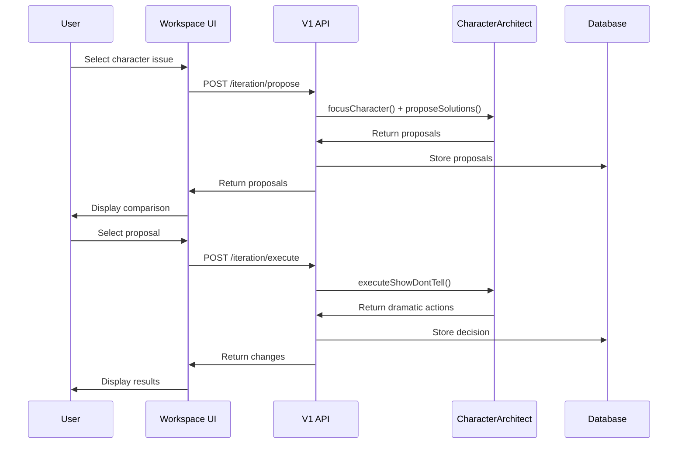

# Epic 005: Interactive Workflow Core - Act 2 Implementation

## Epic Overview
**Epic ID:** EPIC-005
**Epic Name:** Interactive Decision Loop - Character Arc Iteration System
**Priority:** P0 - Core Feature
**Estimated Duration:** 2-3 weeks
**Dependencies:** Epic 004 (Architecture Migration & Act 1 Foundation)

## Epic Goal
Transform the static analysis report into an interactive co-creation workspace by implementing Act 2 (Character Arc Stress Test) with multi-step decision flows and persistent user choices.

## Background & Context

### Current State (Post Epic 004)
- **Architecture:** Database-backed V1 API with async processing
- **Analysis Flow:** Act 1 diagnostic report generated and stored
- **User Experience:** Static report viewing only
- **Decision Making:** No user input after initial analysis
- **Agent System:** ConsistencyGuardian operational for Act 1

### Target State
- **Architecture:** Interactive API supporting multi-step workflows
- **Analysis Flow:** Iterative propose → decide → execute cycles
- **User Experience:** Interactive workspace with decision points
- **Decision Making:** User-guided focus selection and solution choices
- **Agent System:** CharacterArchitect agent for Act 2 processing

## Technical Requirements

### Database Schema Extensions
```prisma
model RevisionDecision {
  id               String   @id
  projectId        String
  act              ActType
  focusName        String   // e.g., character name
  focusContext     Json     // e.g., contradiction description
  proposals        Json     // AI-generated proposals
  userChoice       String   // Selected proposal ID
  generatedChanges Json     // Final AI-generated changes
  project          Project  @relation(fields: [projectId], references: [id])
  createdAt        DateTime @default(now())
  updatedAt        DateTime @updatedAt
}

enum ActType {
  ACT2_CHARACTER
  ACT3_WORLDBUILDING
  ACT4_PACING
  ACT5_THEME
}
```

### API Endpoints Required

#### Iteration Management
- `POST /api/v1/iteration/propose` - Request AI proposals for a focus area
- `POST /api/v1/iteration/execute` - Execute selected proposal
- `GET /api/v1/projects/:id/decisions` - Get all decisions for a project

### CharacterArchitect Agent Implementation

#### Prompt Chain Requirements (P4-P6)
```typescript
interface CharacterArchitect {
  // P4: Focus on character contradiction
  focusCharacter(character: string, contradiction: string): Promise<Context>;

  // P5: Generate solution proposals
  proposeSolutions(context: Context): Promise<{
    solutions: Array<{
      id: string;
      title: string;
      description: string;
      pros: string[];
      cons: string[];
    }>;
  }>;

  // P6: Execute "Show, Don't Tell" transformation
  executeShowDontTell(
    solutionId: string,
    context: Context
  ): Promise<{
    dramaticActions: Array<{
      scene: string;
      action: string;
      reveals: string;
    }>;
  }>;
}
```

### Frontend Components Required

#### Interactive Workspace
```typescript
interface WorkspaceComponents {
  // Navigation showing five acts with progress
  ActProgressBar: React.FC<{currentAct: ActType; completedActs: ActType[]}>;

  // Display diagnostic findings with selection capability
  FindingsSelector: React.FC<{
    findings: Finding[];
    onSelect: (finding: Finding) => void;
  }>;

  // Proposal comparison interface
  ProposalComparison: React.FC<{
    proposals: Proposal[];
    onSelect: (proposalId: string) => void;
  }>;

  // Show generated changes
  ChangesDisplay: React.FC<{
    changes: DramaticAction[];
    onAccept: () => void;
    onModify: (changes: DramaticAction[]) => void;
  }>;
}
```

## User Stories

### Story 1: Interactive Workspace UI Implementation
**Points:** 13
**Priority:** P0
**Description:** Transform analysis results page into interactive workspace with act navigation, focus selection, and proposal display components.

**Acceptance Criteria:**
- [ ] Act progress bar shows five acts with current status
- [ ] Findings from Act 1 are selectable for focus
- [ ] Focus selection form captures character and contradiction
- [ ] Proposal comparison view displays solutions side-by-side
- [ ] Changes display shows dramatic actions clearly
- [ ] Navigation between acts is intuitive
- [ ] Mobile responsive design maintained

### Story 2: CharacterArchitect Agent Development
**Points:** 8
**Priority:** P0
**Description:** Implement CharacterArchitect agent with P4-P6 prompt chains for character arc analysis and solution generation.

**Acceptance Criteria:**
- [ ] Agent implements standard agent interface
- [ ] P4 prompt correctly focuses on character contradiction
- [ ] P5 generates exactly 2 structured proposals
- [ ] P6 produces concrete dramatic actions
- [ ] Output parsing handles LLM variations
- [ ] Error handling for malformed responses
- [ ] Retry logic for API failures

### Story 3: Decision Tracking System Implementation
**Points:** 8
**Priority:** P0
**Description:** Build decision persistence system with RevisionDecision model and iteration APIs for tracking user choices.

**Acceptance Criteria:**
- [ ] RevisionDecision model properly stores all decision data
- [ ] `/propose` API generates and stores proposals
- [ ] `/execute` API processes selection and stores results
- [ ] Decisions retrievable by project
- [ ] Decisions linked to specific acts and focuses
- [ ] Audit trail maintained for all decisions
- [ ] Rollback capability for decisions

## Success Metrics
- [ ] Users complete full Act 2 workflow in < 10 minutes
- [ ] 95% of AI proposals properly structured and actionable
- [ ] All decisions successfully persisted
- [ ] Zero data loss during iteration cycles
- [ ] User satisfaction score > 4/5 for interaction flow

## Risk Assessment

### High Risks
1. **LLM Output Inconsistency**
   - **Risk:** Proposals not following expected structure
   - **Mitigation:** Strong prompt engineering, output validation
   - **Contingency:** Manual override option, fallback templates

2. **Complex User Flow Confusion**
   - **Risk:** Users lost in multi-step process
   - **Mitigation:** Clear progress indicators, contextual help
   - **Contingency:** Simplified mode option

### Medium Risks
1. **Decision Conflict Management**
   - **Risk:** Later decisions contradicting earlier ones
   - **Mitigation:** Conflict detection, warning system
   - **Contingency:** Decision revision capability

2. **Performance with Multiple Iterations**
   - **Risk:** Slow response as decisions accumulate
   - **Mitigation:** Pagination, lazy loading
   - **Contingency:** Archive old decisions

## Dependencies
- Epic 004 completed (Database, V1 API, Act 1)
- DeepSeek API reliable for structured outputs
- Frontend framework supports complex state management
- Design system ready for new components

## Definition of Done
- [ ] All three user stories completed
- [ ] CharacterArchitect agent fully operational
- [ ] Interactive workspace UI implemented
- [ ] Decision tracking system functional
- [ ] End-to-end Act 2 workflow tested
- [ ] Performance benchmarks met
- [ ] User documentation created
- [ ] Integration tests passing

## Technical Notes

### Implementation Strategy
1. **Week 1:** UI components and workspace layout
2. **Week 2:** CharacterArchitect agent and prompt engineering
3. **Week 3:** Decision tracking, integration testing

### Key Implementation Considerations
- Use React Context for workspace state management
- Implement optimistic UI updates for better UX
- Cache proposals to avoid redundant LLM calls
- Use database transactions for decision storage
- Implement comprehensive error boundaries

### State Management Pattern
```typescript
interface WorkspaceState {
  currentProject: Project;
  currentAct: ActType;
  currentFocus: Focus | null;
  proposals: Proposal[] | null;
  decisions: RevisionDecision[];
  isLoading: boolean;
  error: Error | null;
}
```

### Iteration Flow Sequence


## Next Epic Dependencies
This epic enables:
- Epic 3: Multi-Act Agent System (reuses iteration pattern)
- Epic 4: Grand Synthesis Engine (requires decision data)